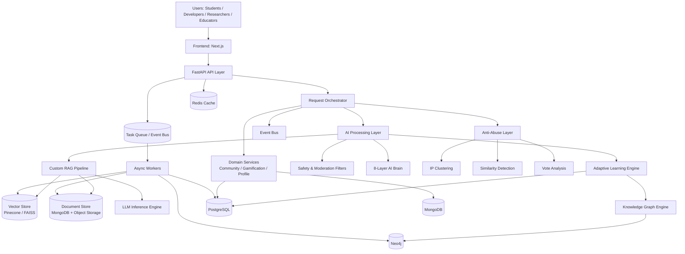
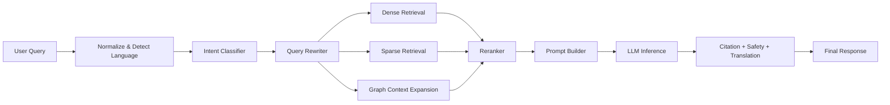
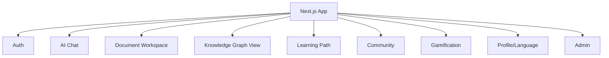
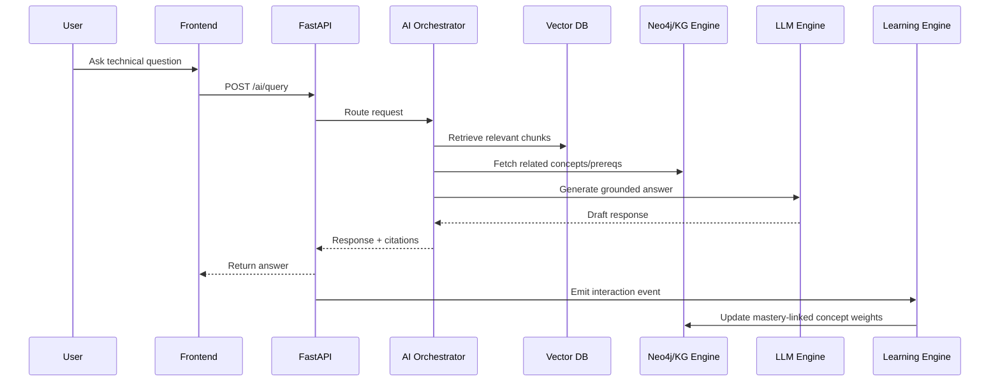
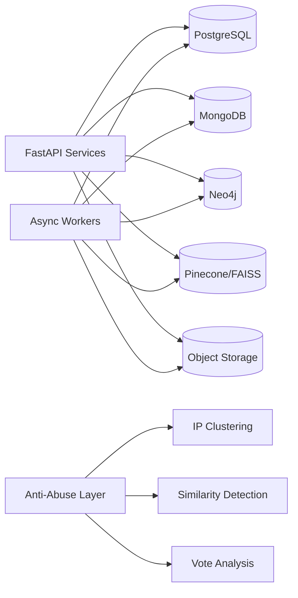
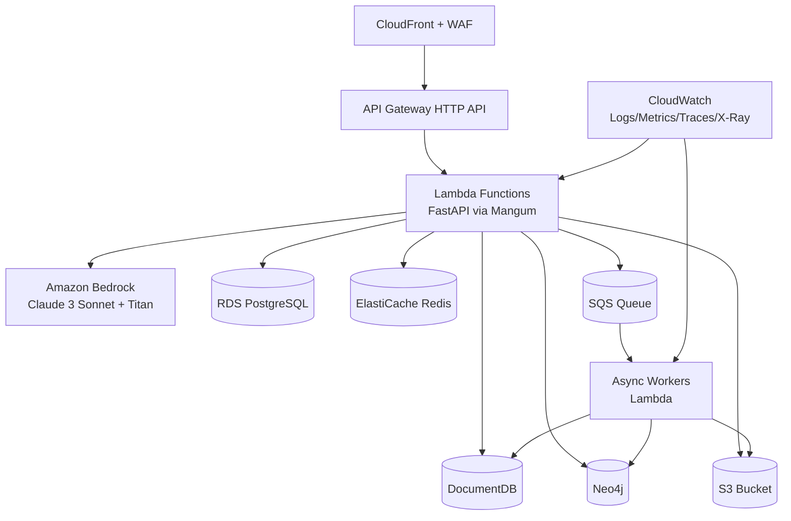

# System Design Document

## Project
**ENTROPY – AI Learning Acceleration Platform**

**Version:** 3.0  
**Date:** 2026-03-05  
**Based On:** SRS v3.0 (`requirements.md`)
**AI Engine:** Entropy

### Revision History
- **v1.0** (2026-02-16): Initial design document
- **v2.0** (2026-03-05): Updated to reflect actual implementation (Entropy AI Engine)
- **v3.0** (2026-03-05): Production-ready version with AWS deployment guidance

---

## 1. Overview
ENTROPY is a web-based AI learning and developer productivity platform for AI for Bharat. It combines a custom RAG pipeline, knowledge graph reasoning, document intelligence, adaptive learning, multilingual delivery, community collaboration, gamification, anti-abuse detection, and async event processing.

This document defines the end-to-end technical architecture and implementation design for production deployment aligned with the approved requirements.

**AWS-Native Deployment:** ENTROPY is designed for production deployment on AWS with:
- Frontend: Amazon CloudFront + Amazon S3 + AWS Amplify
- Backend: AWS Lambda (via Mangum) + Amazon API Gateway HTTP API
- AI: Amazon Bedrock (Claude 3 Sonnet + Titan Embeddings V2)
- Databases: Amazon RDS PostgreSQL + Amazon DocumentDB + Amazon Neo4j
- Storage: Amazon S3 (documents + processed text)
- Caching: Amazon ElastiCache Redis
- Queue: Amazon SQS for async processing

The Entropy AI Engine powers the intelligent reasoning capabilities with 8-layer cognitive architecture.

### 1.1 Design Goals
- Deliver low-latency, grounded AI responses using 8-layer AI Brain architecture (Entropy).
- Support adaptive learning through knowledge gap detection and graph-aware recommendations.
- Scale to high concurrent usage with high availability using async event processing.
- Ensure robust security, data protection, and observability.
- Enable modular evolution of AI components without affecting core API contracts.
- Implement anti-abuse detection with IP clustering, similarity detection, and vote analysis.
- Track mastery with confidence weights and time decay for accurate skill assessment.
- **Deploy to AWS** with serverless architecture, managed services, and cost optimization.

### 1.2 Architectural Style
- **Frontend:** SPA/SSR hybrid using Next.js.
- **Backend:** Modular monolith (initial) with async workers; service boundaries ready for microservice split.
- **AI Runtime:** Pipeline-oriented async orchestration (Entropy AI Engine).
- **Storage:** Polyglot persistence (PostgreSQL, MongoDB, vector DB, Neo4j).
- **Deployment:** AWS-native with Lambda, API Gateway, Bedrock, RDS, DocumentDB, Neo4j, ElastiCache, SQS.

---

## 2. High Level Architecture

### 2.1 Layered Architecture
1. **Frontend Layer** (Next.js + TypeScript + TailwindCSS)
   - UI rendering, session management, user interactions, dashboarding.
2. **Backend API Layer** (FastAPI)
   - REST APIs, authN/authZ, request orchestration, rate limiting.
3. **AI Processing Layer**
   - Query understanding, retrieval orchestration, LLM generation, safety checks.
4. **Knowledge Graph Layer**
   - Concept extraction, graph updates, graph reasoning and recommendations.
5. **Data Storage Layer**
   - PostgreSQL, MongoDB, Pinecone/FAISS, Neo4j, object storage.

### 2.2 High-Level Interaction Flow
- User request enters via frontend and authenticated API gateway.
- Backend orchestrator routes to AI pipeline and/or domain services.
- AI pipeline retrieves context from vector DB and graph DB, then generates response.
- Learning engine updates user model and recommendations.
- Community/gamification events persist to storage and publish to async workers.

### 2.3 Diagram: System Context and Layers


---

## 3. AI System Design

### 3.1 Custom Retrieval Augmented Generation (RAG) Pipeline
**Constraint:** No LangChain; custom orchestration implemented as Python service modules.

#### 3.1.1 Query Processing Stages
1. **Input Normalization:** language detection, text cleanup, token budget estimate.
2. **Intent Classification:** classify into QA, code explanation, document QA, learning recommendation.
3. **Query Rewriting:** expand with synonyms and concept aliases.
4. **Retriever Fan-out:**
   - dense vector retrieval (top-k)
   - optional sparse/BM25 lexical retrieval
   - graph neighborhood expansion (concept-adjacent nodes)
5. **Context Reranking:** cross-encoder reranker selects high-relevance chunks.
6. **Prompt Composition:** instruction + user context + retrieved evidence + safety constraints.
7. **LLM Generation:** produce answer with grounded references.
8. **Post-processing:** citation stitching, toxicity/safety checks, multilingual translation if requested.

#### 3.1.2 RAG Pipeline Diagram


### 3.2 Document Ingestion Pipeline
1. Upload validation (size/type/security scan).
2. File persistence to object storage.
3. Parsing (PyMuPDF for PDF, python-docx for DOCX, native TXT parser).
4. Structural segmentation (title, section, paragraph, table blocks).
5. Text cleanup and language detection.
6. Chunking with overlap (semantic-aware chunker).
7. Embedding generation for chunks.
8. Vector indexing in Pinecone/FAISS.
9. Metadata persistence (MongoDB + PostgreSQL references).
10. Entity/concept extraction and graph update.

### 3.3 Embedding Generation Process
- **Model abstraction:** pluggable transformer embedding model interface.
- **Batching:** dynamic micro-batching to maximize GPU/CPU throughput.
- **Chunk policy:** target token window with overlap for continuity.
- **Versioning:** store embedding model version and chunk hash.
- **Re-index strategy:** triggered on model upgrade or parsing policy changes.

### 3.4 Vector Similarity Search
- Top-k nearest neighbors using cosine similarity.
- Metadata filters: user scope, document scope, language, recency.
- Hybrid retrieval mode: weighted fusion of dense + sparse ranks.
- Optional MMR diversification to reduce redundant chunks.

### 3.5 Knowledge Graph Construction and Reasoning
- **Entity/Concept extraction:** spaCy NER + rule-based domain phrase extraction.
- **Relationship extraction:** pattern + dependency parsing + co-occurrence scoring.
- **Graph schema:** nodes (Concept, Topic, Resource, Skill), edges (PREREQUISITE_OF, RELATED_TO, APPLIED_IN, EXPLAINS).
- **Reasoning operations:**
  - prerequisite traversal
  - weak-link (knowledge gap) detection
  - next-best-concept ranking
  - path explanation for recommendation transparency

### 3.6 Adaptive Learning Engine
- Inputs: user profile, activity stream, correctness signals, session behavior, graph state.
- Learner model computes concept mastery scores using formula:
  ```
  mastery = (correct_attempts / total_attempts) * confidence_weight
  ```
- Confidence weight is reduced by:
  - High hint usage (penalty up to 0.3)
  - Time decay (reduction after 7 days of inactivity)
- Recommendation strategy:
  - prioritize high-impact prerequisites
  - blend user goals with graph centrality and difficulty slope
  - avoid abrupt jumps in complexity
- Outputs: next topic list, estimated study time, confidence.

### 3.7 LLM Response Generation
- Supports task templates: explain, summarize, code explain, compare concepts.
- Enforces grounded generation with retrieval context and citation tags.
- Safety layer blocks disallowed responses; fallback to safe response templates.
- Optional translation post-pass for regional language output.

### 3.8 8-Layer AI Brain Architecture
1. **Language Detection**: Auto-detect input language; translate to English if needed.
2. **Context Assembly**: Gather user profile, mastery state, and session context.
3. **Intent Detection**: Classify query type (QA, code explanation, concept mapping).
4. **Concept Mapping**: Extract and resolve concepts to graph nodes.
5. **Graph Traversal**: Fetch prerequisites, related concepts, and learning paths.
6. **Reasoning Engine**: Generate answer with reasoning trace and confidence score.
7. **NLI Validation**: Verify response consistency with retrieved context.
8. **Trust Scoring**: Compute trust components and final trust score.

### 3.9 Anti-Abuse Detection
- **IP Clustering**: Group users by IP to detect suspicious patterns.
- **Content Similarity**: Compute hashes and embeddings for duplicate detection.
- **Vote Analysis**: Detect mutual voting and vote rings in community content.
- **Trust Scoring**: Calculate trust based on mastery reliability and NLI track record.

---

## 4. Component Design

## 4.1 Frontend Design (Next.js)

### 4.1.1 Architecture
- **Routing:** Next.js App Router.
- **Rendering strategy:**
  - SSR for SEO/public pages.
  - CSR for interactive dashboards and chat sessions.
- **State management:** React Query for server state + lightweight client store for UI state.
- **API integration:** typed client using OpenAPI-generated interfaces.

### 4.1.2 UI Modules
1. Authentication module
2. AI Chat & Explanation module
3. Document workspace module
4. Knowledge graph explorer module
5. Learning path dashboard module
6. Community and mentorship module
7. Gamification (XP, coins, leaderboards) module
8. Profile and language preferences module
9. Admin moderation module

### 4.1.3 Frontend Authentication Flow
1. User submits credentials/OAuth token.
2. Backend returns signed access token + refresh token.
3. Access token attached to API requests.
4. Silent refresh before expiry.
5. Route guards enforce role-based page access.

### 4.1.4 Diagram: Frontend Module Map


## 4.2 Backend Design (FastAPI)

### 4.2.1 Service Modules
- `auth_service`: login, token lifecycle, RBAC.
- `user_service`: profile, preferences, goals.
- `ai_service`: query orchestration and response generation.
- `document_service`: upload, parsing jobs, document metadata.
- `kg_service`: concept graph CRUD and reasoning APIs.
- `learning_service`: mastery model and recommendations.
- `community_service`: posts, answers, mentorship matching.
- `gamification_service`: XP, coins, levels, achievements.
- `admin_service`: moderation and analytics endpoints.

### 4.2.2 API Endpoint Groups (Representative)
- `/api/v1/auth/*`
- `/api/v1/users/*`
- `/api/v1/ai/query`
- `/api/v1/documents/upload`, `/api/v1/documents/{id}/ask`
- `/api/v1/graph/concepts`, `/api/v1/graph/recommendations`
- `/api/v1/learning/path`, `/api/v1/learning/gaps`
- `/api/v1/community/posts`, `/api/v1/community/mentorship`
- `/api/v1/gamification/profile`, `/api/v1/gamification/leaderboard`
- `/api/v1/admin/moderation/*`
- `/api/v1/reasoning/ask` - Structured reasoning with AI Brain
- `/api/v1/evaluation/evaluate` - Rubric-based evaluation
- `/api/v1/mastery/attempt` - Mastery tracking with confidence weights
- `/api/v1/anti-abuse/ip-clusters` - IP clustering reports
- `/api/v1/anti-abuse/similarity` - Content similarity detection
- `/api/v1/anti-abuse/vote-analysis` - Vote ring detection

### 4.2.3 Async Processing
- Event bus for async processing of domain events (doubt creation, mastery updates, community interactions).
- Async workers for ingestion, embedding, graph updates, and scheduled recomputation.
- Task states tracked in PostgreSQL; progress events pushed to clients via WebSocket/SSE.
- Retry policy with exponential backoff and dead-letter queue for persistent failures.

## 4.3 AI Component Design

### 4.3.1 Document Processing Pipeline
- Ingestion API stores file and creates processing job.
- Worker executes parser -> chunker -> embedding -> indexer.
- Output artifacts linked by `document_id` and `chunk_id`.

### 4.3.2 NLP Entity Extraction
- spaCy pipeline + custom phrase matcher for AI/CS domain terms.
- Entity confidence thresholds and post-filtering to reduce noise.

### 4.3.3 Embedding Engine
- Stateless service endpoint for embedding batches.
- Supports CPU fallback when GPU unavailable.

### 4.3.4 Knowledge Graph Engine
- Batch upsert nodes/edges into Neo4j.
- Relationship confidence and provenance metadata stored per edge.

### 4.3.5 Learning Engine
- Periodic and event-driven mastery score updates using formula:
  ```
  mastery = (correct_attempts / total_attempts) * confidence_weight
  ```
- Confidence weight reduced by hint usage and time decay.
- Returns recommended sequence with rationale from graph paths.

### 4.3.6 Anti-Abuse Engine
- IP clustering for suspicious activity detection.
- Content similarity detection using hashes and embeddings.
- Vote analysis for detecting mutual voting and vote rings.
- Trust scoring based on mastery reliability and NLI track record.

### 4.3.7 Event Bus
- Async event processing for domain events.
- Multiple handlers per event type for decoupled workflows.
- Event types: doubt creation, mastery updates, community interactions, gamification actions.

---

## 5. Data Flow Design

### 5.1 User Query Flow
1. Frontend sends authenticated query.
2. API gateway validates token and rate limits request.
3. AI orchestrator classifies intent.
4. RAG and graph context retrieval executed.
5. LLM generates grounded response.
6. Safety + translation + formatting applied.
7. Response returned and interaction event logged.
8. Learning engine receives event for mastery update.

### 5.2 Document Upload Flow
1. User uploads file and metadata.
2. Backend validates and stores file.
3. Async job parses and chunks content.
4. Embeddings generated and indexed.
5. Concept extraction updates graph.
6. Job status updates visible in UI.

### 5.3 AI Reasoning Pipeline Flow
- Query -> language detection -> context assembly -> intent detection -> concept mapping -> graph traversal -> reasoning engine -> NLI validation -> trust scoring -> citation + safety -> response.

### 5.4 Knowledge Graph Update Flow
1. New document/query interaction event captured.
2. Candidate entities/relations extracted.
3. Confidence-scored updates merged with deduplication.
4. Graph consistency checks and provenance tagging.
5. Recommendation cache invalidation and refresh.

### 5.5 Anti-Abuse Detection Flow
1. User activity captured (IP, content, votes).
2. IP clustering identifies suspicious patterns.
3. Content similarity detects duplicates.
4. Vote analysis identifies vote rings.
5. Trust score computed and applied to user profile.

### 5.6 Event Processing Flow
1. Domain event emitted to event bus.
2. Registered handlers process event asynchronously.
3. State updates persisted to databases.
4. Progress events pushed to clients via WebSocket/SSE.

### 5.5 Diagram: End-to-End Query + Learning Update


---

## 6. Database Design

## 6.1 Storage Responsibility Matrix
- **PostgreSQL:** transactional user/profile/auth, learning progress snapshots, gamification counters, community metadata.
- **MongoDB:** document chunks, retrieval metadata, conversation transcripts, flexible AI artifacts.
- **Neo4j:** concept graph nodes/edges and reasoning indexes.
- **Pinecone/FAISS:** embedding vectors for retrieval.
- **Object Storage:** raw uploaded files.

## 6.2 Logical Schemas

### 6.2.1 User Schema (PostgreSQL)
- `users(user_id, email, password_hash, role, status, created_at, updated_at)`
- `user_profiles(user_id, display_name, bio, preferred_language, goals, skill_level)`
- `user_sessions(session_id, user_id, refresh_token_hash, expires_at, device_info)`

### 6.2.2 Document Schema (MongoDB + PostgreSQL index table)
- Mongo collection `documents`
  - `_id`, `user_id`, `title`, `file_type`, `storage_uri`, `status`, `metadata`, `created_at`
- Mongo collection `document_chunks`
  - `_id`, `document_id`, `chunk_index`, `text`, `language`, `embedding_id`, `section_ref`
- PostgreSQL `document_jobs(job_id, document_id, state, progress, error_code, started_at, ended_at)`

### 6.2.3 Community Schema (PostgreSQL)
- `communities(community_id, name, domain, visibility, created_by, created_at)`
- `posts(post_id, community_id, author_id, title, body, upvotes, accepted_answer_id, created_at)`
- `answers(answer_id, post_id, author_id, body, upvotes, created_at)`
- `mentorship_requests(request_id, mentee_id, domain, goals, status, created_at)`
- `mentorship_matches(match_id, mentor_id, mentee_id, score, status, created_at)`

### 6.2.4 Gamification Schema (PostgreSQL)
- `xp_ledger(entry_id, user_id, source_type, source_id, xp_delta, created_at)`
- `coin_ledger(entry_id, user_id, source_type, source_id, coin_delta, created_at)`
- `user_levels(user_id, level, total_xp, updated_at)`
- `achievements(achievement_id, code, title, criteria_json)`
- `user_achievements(user_id, achievement_id, unlocked_at)`
- `leaderboard_snapshots(snapshot_id, period, domain, ranking_json, generated_at)`

### 6.2.5 Knowledge Graph Storage (Neo4j)
- Node labels: `Concept`, `Topic`, `Skill`, `Resource`, `UserConceptState`
- Edge types: `PREREQUISITE_OF`, `RELATED_TO`, `APPLIED_IN`, `EXPLAINS`, `LEARNING_EDGE`
- Key properties: `confidence`, `source`, `last_validated_at`, `weight`

### 6.2.6 Diagram: Data Stores and Ownership


---

## 7. Deployment Architecture

### 7.1 Containerization (Docker)
- Each service packaged as independent Docker image:
  - `frontend` (Next.js)
  - `api` (FastAPI)
  - `worker` (async jobs)
  - `scheduler` (periodic tasks)
  - `redis` (cache/queue broker)
- Images versioned by commit SHA and semantic release tag.

### 7.2 CI/CD Pipeline
1. Code push triggers CI workflow.
2. Linting, unit tests, integration tests.
3. Security scans (SAST + dependency scan).
4. Build and publish Docker images.
5. Deploy to staging; run smoke tests.
6. Manual/automated promotion to production.
7. Blue-green or rolling deployment strategy.

### 7.3 Cloud Deployment Model
- **AWS Lambda** - Serverless compute with API Gateway HTTP API
- **Amazon Bedrock** - Claude 3 Sonnet for reasoning, Titan Embeddings for vectors
- **Amazon RDS PostgreSQL** - Managed relational database
- **Amazon DocumentDB** - Managed MongoDB-compatible database
- **Amazon Neo4j** - Managed graph database
- **Amazon S3** - Document storage and processed text
- **Amazon ElastiCache Redis** - Caching
- **Amazon SQS** - Async message queue
- **Amazon CloudFront** - CDN for static assets
- **AWS IAM** - Identity and access management with least-privilege
- **AWS KMS** - Encryption at rest
- **Amazon WAF** - Web application firewall for API Gateway

### 7.4 Scalability Strategy
- **Lambda concurrency** - Auto-scaling based on API Gateway request rate
- **SQS-driven scaling** - Worker scaling based on queue backlog
- **Read replicas** - For RDS PostgreSQL and DocumentDB
- **ElastiCache** - Hot path caching for retrieval metadata and session context
- **Lambda power tuning** - Optimize memory/CPU for cost/performance
- **Multi-AZ deployment** - Automatic failover for managed databases

### 7.5 Diagram: Deployment Topology


---

## 8. Security Design

### 8.1 Authentication
- JWT-based access token + rotating refresh token.
- OAuth2/OpenID Connect optional for social/enterprise login.
- Session revocation and device-aware login records.

### 8.2 Authorization
- Role-based access control: learner, mentor, educator, admin.
- Resource-level checks on document ownership and community permissions.
- Admin-only moderation and analytics actions.

### 8.3 Data Protection
- TLS 1.2+ for all in-transit traffic.
- Encryption at rest for database and object storage.
- Hashing and salting for password storage (`argon2`/`bcrypt`).
- PII minimization and configurable retention policies.

### 8.4 Application Security Controls
- Input validation and output encoding.
- API rate limiting and abuse detection.
- CSRF protection where cookie-based flows are used.
- Prompt injection mitigation via context isolation and allowlist policies.
- Audit logging for admin/moderation actions.

---

## 9. Performance Optimization

### 9.1 Caching Strategies
- Redis cache layers:
  - auth/session token metadata cache
  - frequent query-response cache with short TTL
  - recommendation cache per user snapshot
- CDN caching for static assets and non-sensitive public resources.

### 9.2 Indexing Strategy
- PostgreSQL composite indexes on high-traffic query paths.
- MongoDB indexes on `document_id`, `user_id`, `created_at`, and status fields.
- Neo4j indexes on concept identifiers and relationship traversal keys.
- Vector index tuning for dimension, metric, and top-k latency.

### 9.3 Asynchronous Processing
- Offload heavy tasks: parsing, OCR, embedding, graph recompute, leaderboard snapshot generation.
- Non-blocking API patterns with job status polling/WebSocket notifications.

### 9.4 Capacity Targets (Aligned with NFR)
- P95 AI response <= 3.5s for standard QA under normal load.
- P95 document QA <= 5s for indexed documents.
- Monthly availability >= 99.9%.

---

## 10. Reliability, Observability, and Operations

### 10.1 Reliability Patterns
- Idempotent job submission keys for ingestion.
- Circuit breakers for external model/vector services.
- Retry with backoff and dead-letter queue handling.

### 10.2 Observability
- Structured logs with correlation IDs.
- Metrics: latency, token usage, retrieval hit rates, failure rates, queue lag.
- Distributed tracing across API -> retrieval -> generation -> post-processing.
- Alerting on SLA/SLO breaches and anomalous error spikes.

### 10.3 Operational Runbooks
- Incident triage workflow and severity matrix.
- Rollback plan for model and service deployments.
- Backup and restore validation (daily backups, periodic restore drills).

---

## 11. Implementation Roadmap (Suggested)

### Phase 1 (MVP)
- Auth, AI query, document upload + RAG, basic communities, baseline gamification, multilingual translation, 8-layer AI Brain reasoning.

### Phase 2
- Full knowledge graph reasoning, adaptive learning path engine, mentorship matching, advanced moderation, anti-abuse detection, event-driven async processing.

### Phase 3
- Advanced analytics, model optimization, expanded language coverage, personalization tuning, trust-based reputation system.

---

## 12. Risks and Mitigations
1. **Hallucinations / low grounding quality**  
   Mitigation: stronger reranking, citation enforcement, confidence-based fallback, NLI validation.

2. **High inference cost**  
   Mitigation: caching, model routing by task complexity, token budget controls.

3. **Graph quality drift**  
   Mitigation: confidence thresholds, periodic validation jobs, provenance tracking.

4. **Latency spikes under peak load**  
   Mitigation: autoscaling, queue smoothing, degraded-mode responses.

5. **Multilingual translation inconsistency**  
   Mitigation: language-specific QA datasets, post-edit quality scoring, glossary constraints.

6. **Anti-abuse evasion**  
   Mitigation: multi-layer detection (IP, similarity, votes), continuous model updates, manual review.

7. **Trust score manipulation**  
   Mitigation: multiple signal sources, time-weighted signals, anomaly detection.

8. **Event processing failures**  
   Mitigation: dead-letter queues, retry with backoff, idempotent handlers, monitoring.

---

## 13. Diagram Descriptions (Textual Summary)
- **System Context and Layers:** Shows users interacting with frontend, backend orchestration, AI layer, graph layer, and polyglot storage.
- **RAG Pipeline:** Shows sequential and parallel steps from normalization through retrieval, reranking, generation, and safety/translation.
- **Frontend Module Map:** Shows main UI modules and their grouping in Next.js app architecture.
- **End-to-End Sequence:** Shows query lifecycle from user request to response and learning model update.
- **Data Ownership Diagram:** Shows which services write/read from PostgreSQL, MongoDB, Neo4j, vector store, and object storage.
- **Deployment Topology:** Shows cloud edge, Kubernetes services, managed databases, workers, and observability stack.

---

## 14. Technology Mapping
- **Frontend:** Next.js, TypeScript, TailwindCSS
- **Backend:** FastAPI (Python)
- **AWS Lambda:** Serverless compute via Mangum
- **API Gateway:** HTTP API with custom authorizers
- **AI/NLP:** custom RAG, transformer embeddings, spaCy, LLM inference engine
- **Retrieval:** Pinecone / FAISS
- **Graph:** Neo4j + NetworkX
- **Doc Processing:** PyMuPDF (+ DOCX/TXT parser stack)
- **Databases:** RDS PostgreSQL, DocumentDB, Neo4j
- **Async Processing:** Event bus with async handlers, SQS
- **Anti-Abuse:** IP clustering, content hashing, embedding similarity, vote analysis
- **Gamification:** XP engine with trust multipliers, streak manager, achievement engine
- **Multilingual:** deep-translator (Google Translate backend), langdetect
- **Reasoning:** 8-layer AI Brain architecture with NLI validation and trust scoring (Entropy)
- **Infrastructure:** AWS CDK, Docker, GitHub Actions CI/CD
- **Monitoring:** CloudWatch, X-Ray, CloudWatch Alarms

---

## 15. AWS-Native Deployment Architecture

### 15.1 Frontend Layer
- **Amazon CloudFront** - CDN with S3 origin for static assets
- **Amazon S3** - Static asset hosting with versioning
- **AWS Amplify** - Frontend deployment and hosting with CI/CD

### 15.2 API Layer
- **API Gateway HTTP API** - Serverless API with custom JWT authorizers
- **AWS Lambda** - FastAPI via Mangum adapter (power-optimized)
- **Lambda Power Tuning** - Optimize memory/CPU for cost/performance

### 15.3 AI Layer
- **Amazon Bedrock** - Claude 3 Sonnet for reasoning, Titan Embeddings V2 for vectors
- **Lambda Power Tuning** - Optimize for inference latency (< 2s P95)

### 15.4 Data Layer
- **Amazon RDS PostgreSQL** - Multi-AZ with automated backups
- **Amazon DocumentDB** - Managed MongoDB-compatible database
- **Amazon Neo4j** - Managed graph database with high availability

### 15.5 Caching & Queue
- **Amazon ElastiCache Redis** - Caching for frequently accessed data
- **Amazon SQS** - Async processing queue for background jobs

### 15.6 Security
- **AWS IAM** - Least-privilege access for all services
- **AWS KMS** - Encryption at rest for all data stores
- **Amazon WAF** - Web application firewall for API Gateway
- **VPC** - Private subnets for databases

### 15.7 DevOps
- **AWS CDK** - Infrastructure as Code
- **GitHub Actions** - CI/CD pipeline with automated testing and deployment

---

## 16. AWS Services Required for Deployment

### Compute
- **AWS Lambda** - Serverless compute for API endpoints
- **AWS Amplify** - Frontend hosting and CI/CD

### API & Networking
- **Amazon API Gateway HTTP API** - Serverless API with custom authorizers
- **Amazon CloudFront** - CDN for static assets and API responses
- **Amazon VPC** - Private networking for databases

### AI & ML
- **Amazon Bedrock** - Claude 3 Sonnet for LLM, Titan Embeddings for vectors

### Databases
- **Amazon RDS PostgreSQL** - Primary relational database (multi-AZ)
- **Amazon DocumentDB** - MongoDB-compatible document database
- **Amazon Neo4j** - Managed graph database (high availability)

### Storage
- **Amazon S3** - Document storage and processed text
- **Amazon ElastiCache Redis** - Caching layer

### Queue & Messaging
- **Amazon SQS** - Async message queue for background jobs

### Security
- **AWS IAM** - Identity and access management
- **AWS KMS** - Encryption at rest
- **Amazon WAF** - Web application firewall

### Monitoring & Logging
- **Amazon CloudWatch** - Logs, metrics, alarms
- **AWS X-Ray** - Distributed tracing

### Configuration Management
- **AWS Systems Manager (SSM) Parameter Store** - Secure configuration storage

---

## 17. Deployment Checklist

### Pre-Deployment
- [ ] Create AWS account and configure CLI credentials
- [ ] Set up VPC with public/private subnets
- [ ] Create RDS PostgreSQL instance (multi-AZ)
- [ ] Create DocumentDB cluster
- [ ] Create Neo4j instance (high availability)
- [ ] Create S3 buckets for documents
- [ ] Create ElastiCache Redis cluster
- [ ] Configure IAM roles for Lambda
- [ ] Set up SSM parameters for secrets
- [ ] Configure CloudFront distribution
- [ ] Set up CloudWatch alarms

### Deployment
- [ ] Deploy Lambda function using serverless.yml
- [ ] Configure API Gateway with Lambda integration
- [ ] Deploy frontend to AWS Amplify
- [ ] Configure CORS and WAF rules
- [ ] Run database migrations
- [ ] Seed knowledge graph with initial concepts

### Post-Deployment
- [ ] Verify health endpoint returns healthy status
- [ ] Test LLM inference via Bedrock
- [ ] Verify database connections
- [ ] Test Redis caching
- [ ] Run smoke tests for critical paths
- [ ] Configure monitoring dashboards

---

## 18. Cost Optimization Strategies

1. **Lambda Power Tuning** - Optimize memory/CPU for each function
2. **Caching** - Use Redis to reduce database and LLM calls
3. **Model Routing** - Route simple queries to cheaper models
4. **Reserved Capacity** - Consider reserved capacity for Neo4j
5. **S3 Lifecycle Policies** - Move old documents to Glacier
6. **Auto-scaling** - Scale down during off-peak hours

---

## 19. Maintenance & Operations

### Daily
- Monitor CloudWatch alarms
- Review Lambda error logs
- Check database connection pool status

### Weekly
- Review security logs
- Check backup status
- Monitor S3 storage usage

### Monthly
- Review and optimize Lambda costs
- Update dependencies
- Run disaster recovery drills

---

**Document Version:** 3.0  
**Last Updated:** 2026-03-05  
**Maintained By:** AI for Bharat Platform Team
